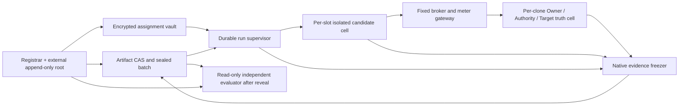

# Wave 025：blind comparison runner 复用架构

日期：2026-08-01  
状态：`INDEPENDENT RUNTIME REUSE ARCHITECTURE / NO IMPLEMENTATION / NO ARM RANKING`

## 结论

下一步不需要重新发明 runner、ledger、签名协议或 workflow。Wave 013、015、021、023、024
已经留下足够多可直接复用的成熟内核；真正缺的不是更多 schema，而是把这些内核放进三个此前
没有共同闭合的边界：

1. **真实运行时隔离**：candidate 不能读取批次根、其他 clone、运行顺序、world 私有状态、
   controller/evaluator 文件、进程或共享 cache；
2. **运行前外部锚定的隐藏随机化**：candidate、world、evaluator、seed、assignment、顺序、
   stop/repair rule 在第一只 candidate 启动前已被不可后改地绑定，但 seed、映射和顺序不会因
   一个可枚举的普通 hash 暴露；
3. **可恢复而不改题的控制面**：supervisor、candidate、Target、provider 或 evaluator 崩溃后，
   恢复只能继续同一个已冻结 slot，或按预注册规则保留为 `INVALID/MISSING`；不能静默换 world、
   换 candidate、加 retry、挑结果好看的 slot 重跑。

最小完整方案应当是一个**自有的、很薄的语义与证据控制层**，组合现成的 Linux/VM 隔离、OCI
artifact、SQLite、Ed25519、OS CSPRNG/HMAC、内容寻址存储和 append-only/WORM 锚。通爻需要
自持的是 exact Q、public projection、semantic trigger、truth-owner receipt、批次状态机和
independent evaluator；不应自研密码学、容器内核、数据库或虚拟机。

这会得到一个 `LOCAL_SYNTHETIC_ISOLATED_BLIND_RUNNER_QUALIFIED` 候选，而不是 A1–A5 结果。
任何实际比较、覆盖率、成本 Pareto 或赢家仍为 `NOT_RUN / NONE`。

## 研究边界与 blindness 的准确含义

本文件独立读取 `research/NOW.md`、本轮 `PROGRAM.md`、Wave 024 最终问题/设计/独立审计/
root acceptance，并直接审计 Wave 013、015、021、023 的文档和实现。没有读取同一 Wave 025
目录中其他研究者的输出。

这里要隐藏的是：

- semantic case、S/R/U role、Authority stratum 的私有结论；
- expected disposition、Effect truth、failure schedule；
- world×treatment×replicate assignment 与批次执行顺序；
- 其他 treatment/replicate 的 transcript、状态、评分和修复；
- evaluator private truth 与 grader feedback。

这里不假装能让一个模型不知道自己是模型、让真人不知道自己是人，或让确定性程序不知道自己
包含规则。treatment 的原生计算方式是比较对象，不应被抹平。正确目标是：**各 treatment 面对
相同的 world-facing public bytes、合法 action grammar、Owner/Target API、failure semantics 和
预算规则；其内部原生资源可以不同，但必须在 candidate seal 中冻结并由 meter 记录。**

### 威胁模型

本架构把 candidate 当作好奇或敌对程序：它会枚举目录、`/proc`、环境、FD、socket、DNS、
网络、时钟和错误形状，也可能故意利用 opaque ID 分支。它不能被假定遵守“不要读取”的提示。

以下域仍是受信假设：

- isolation host/hypervisor 与内核；
- external registrar/root anchor；
- exact Owner/Authority/Target truth service 自己的私钥与 mutation boundary；
- 最终 read-only evaluator 的代码 preimage。

本轮即使按本文实现，也不自动覆盖：恶意 hypervisor/host admin、microarchitectural covert
channel、registrar 与 truth owner 合谋、外部模型 provider 的隐藏跨请求记忆、真实法律
Authority、物理 Effect 或真人是否真正理解并认领。不能把 host/VM 隔离称作信息论盲性。

## 既有成果：直接复用什么，淘汰什么

| 来源 | 可直接复用的成熟内核 | 不能直接继承的部分 | Wave 025 处理 |
|---|---|---|---|
| Wave 013 | exact Q；Authority→EXECUTE→occurrence/sample→readback→Acceptance→finality 的内容父引用；process-native key/log/freeze receipt；evaluator 不 import runtime | blacklist public projection；owner endpoint 数量暴露 topology；同 UID 临时 cwd；修改 parent `sys.argv`；本地 self-seal | 保留语义链、native freeze 和 evaluator分离；弃用其 candidate launcher/seal |
| Wave 015 | fail-closed `ArmViewFactory`；nested private scalar/hash 扫描；α-normal form；固定 Broker surface；semantic hidden controller receipt；SQLite Target ledger、CAS、idempotent receipt/readback | `ARM_VIEW` 显式含 `arm_id`，与 Wave 021 冻结规则冲突；`multiprocessing.spawn` 仍继承 parent，模块 lock 不保护别的进程；同 UID/FD/timing 未隔离；controller seal 同权限 | 改成 exec/OCI/VM launcher；bootstrap 删除 semantic `arm_id`；复用 view/ledger/controller 语义，不复用安全声明 |
| Wave 021 | 完整任务分母；A1 applicability；capability-max/equalized-causal 两层；同预算与 raw cost vector；semantic native failure trigger；固定 stop/repair 规则 | validator 只验 plan 的自报字段，没有 actual bytes、candidate、provider、world、meter 或 native receipt | 作为 BatchContract 与 evaluator 的规范来源，不作为运行准入证明 |
| Wave 023 | closed keys、duplicate-key reject、完整 Q byte preimage、candidate artifact slots、world clone规则、actual launch receipt字段、closed budget ledger、actual mode hard reject | 全部仍是 development fixture；Authority key自带；candidate 是文本；launch/clone/isolation 是声明；`sha256(order)` 对小排列可枚举；无外部 root | 复用 schema纪律、candidate closure、meter 和 hard-reject；用外部锚、秘密盐承诺和 host-observed receipts 替换自述 |
| Wave 024 | signed versioned Authority；Target-consumed durable fence；Target-local atomic gate/Effect/refusal；独立 ACK-drop；exact status/readback 恢复；owner-native后置条件 | 固定 S→R→U、同 UID 文件/进程和 timing 泄漏；Target restart、external root 未检验；不是 A1–A5 run | 把这些作为所有 arm 共用 world truth primitive；blind runner 不重复发明它们 |

另一个必须继承的修复约束是：**跨域 owner 不能只签 controller 提供的 predecessor hash 或摘要。**
例如 Authority 若要签“在 S Effect 之后”的 successor，必须在自己的进程/权限域内验证完整
Target certificate、签名、exact Q/object/Target/operation/epoch/head/decision/Effect，再把验证过的
native receipt hash 写入自己签出的 successor。controller 只负责传输和调度，不是跨域因果
truth owner。

### 已解决的与真实缺口

现在已经有解、不得再次包装成“创新”的部分：

- public schema 的 exact allowlist 与 unknown-field fail closed；
- Target-local serial transaction、CAS、one-shot capability 和 idempotent status/readback；
- authenticated native receipts、hash chain、terminal freeze；
- ACK lost 后先 status/readback、禁止盲 replay；
- semantic native event trigger 和 Owner/Target truth 分离；
- 完整 Q、Effect、Acceptance、finality 与 raw cost vector 的评价坐标。

仍然承重的真实缺口：

1. hostile candidate 与 controller/evaluator/其他 clone 的 filesystem/process/network/cache 隔离；
2. 不是自述而是 host/kernel 观察到的 launch/isolation receipt；
3. 不可枚举、运行前锚定且运行后可复算的 seed/assignment/order commitment；
4. candidate bundle、world template、evaluator、policy、stop rule 与全部 slot 的外部 pre-run root；
5. supervisor crash 后不改变 assignment、预算、trigger 或 rerun rule 的 durable state machine；
6. A3 provider identity/prompt/tools/usage/cache 与 A5 real-human/console/carryover 的原生 receipt；
7. pre-divergence timing/error/traffic envelope 的实测，而不是 `same=true`；
8. Target/Owner restart、snapshot/WAL closure 与 run evidence freeze 的统一恢复边界。

## 最小完整架构



这些是逻辑组件，不要求十个产品。最小部署需要五个不能互相混写的权限域：

1. **Registrar/root 域**：在运行前保存 seal 与秘密承诺，提供 append-only API；candidate、world
   worker 和 supervisor 无覆盖权；
2. **Supervisor 域**：只读取一个 slot 的 assignment，启动/终止/恢复，写 orchestration events；
   不签 Effect、Acceptance 或评价；
3. **Candidate cell**：每个 slot 独立 UID/namespace/VM、rootfs、scratch、PID/network/time surface；
   只见 bootstrap、固定 broker 与 treatment-native gateway；
4. **World truth cell**：每个 clone 独立 Owner/Authority/Target key 和 durable store；candidate
   不能挂载；所有 mutation 只经 native API；
5. **Evaluator 域**：批次 close/reveal 后才启动，只读冻结 evidence；无 candidate/world write、
   无 evaluated-episode rerun API。

### 1. Batch compiler 与 artifact CAS

Batch compiler 只做确定性编译，不运行 candidate。输出：

- 完整 `BatchContract`：Q bytes、case/stratum/intervention 分母、预算、missingness、N、estimand、
  stop/repair rule；
- 每个 treatment 一个 `CandidateBundle`：executable/OCI image、model、prompt、tool policy、console、
  adapter 和 dependency lockfile 的实际 bytes/hash；
- `EvaluatorBundle`：evaluator executable、schema、codec 与 policy hash；
- `WorldTemplate`：Owner/Target初态、可接受的唯一 hidden diff、native service image与 schema；
- `IsolationProfile`、`BrokerProtocol`、`MeterPolicy`；
- 全部 slot 的数量和 blocked strata，但不在 candidate-visible位置放 assignment。

CAS 只接受按 hash 取回的不可变对象。任何 artifact 变更都产生新 digest 与新 batch；不能以
`latest`、mutable tag 或 provider 显示名作为证据身份。OCI tag 只作导航，实际绑定 manifest
digest、platform、layer/rootfs digest 和 entrypoint bytes。

### 2. Randomization registrar 与秘密 assignment vault

使用 OS CSPRNG 生成 256-bit `seed` 和独立 256-bit `commit_nonce`。不要只保存
`SHA256(order)`：当 run 数较小时，candidate 可枚举所有排列反查。

推荐固定、可跨语言复算的算法：

```text
C_seed   = H("W025-SEED-v1" || batch_id || seed)
stream   = HMAC-SHA256(seed, "W025-PERM-v1" || block_id || counter)
order    = rejection-sampled Fisher-Yates(stream)
C_order  = H("W025-ORDER-v1" || batch_id || commit_nonce || canonical(order))
C_assign = H("W025-ASSIGN-v1" || batch_id || commit_nonce || canonical(assignments))
```

算法版本、实现 hash、block definition、slot count、`C_seed/C_order/C_assign` 在第一只 candidate
启动前写入 external root。`seed`、nonce、order、world role 和 treatment-slot mapping 加密存入
AssignmentVault；只向 supervisor 逐 slot 解封，永不进入 candidate cell。

randomization 至少按 case/Authority stratum/intervention/replicate block；world template 的语义
preimage先冻结，再分配 treatment。S/R twin 若目标是第一个 lawful response 前逐字节同形，应在
隔离 clone 内复用**同一组 candidate-visible opaque bytes**，而不是只证明 α-equivalence。
独立 clone 的真实 namespace、key、store 仍不同，由 root/evaluator 私下映射。其他 replicate
可以 α-renaming，但 opaque ID 的值分布也必须随机平衡，防止 candidate 以 ID parity 分支。

### 3. Isolation provider

candidate launcher 不再用 Python `multiprocessing.spawn` 前临时修改全局 `sys.argv/cwd/env`。
该方法最多适合 cooperative unit test；模块内 lock 也无法串行化其他进程的并发 spawn。

Linux qualification backend 的最低实现是：

- candidate 与 supervisor/root 不同 host UID；
- user、mount、PID、IPC、UTS、network namespace；
- 只读 content-addressed rootfs，独立临时 scratch，无 host/run-root bind mount；
- cgroup v2 CPU/memory/PID/IO 上限；
- `execve/posix_spawn` 或 OCI exec 的显式 argv/env/cwd，`close_fds` 后只传 allowlisted FD；
- seccomp + 可用 LSM policy，禁止 mount、ptrace、host process enumeration 和未授权 socket；
- 默认无外网；只允许固定 broker/provider gateway；DNS 也经 gateway；
- per-slot namespace、keyset、volume、cache、provider session；slot 结束后销毁；
- supervisor 从 host/cgroup/namespace 读取实际 process、mount、FD、network、image 和 resource
  receipt，candidate 自报只作诊断。

若 candidate 是任意不可信二进制，或需要更强于 namespace 的隔离，使用 per-slot microVM；OCI
bundle仍作为 VM 内可移植 artifact。macOS 本地 cooperative harness可以继续做开发，但一次正式
blind qualification 应在隔离 Linux VM/host 中运行；仅靠 macOS 同 UID 临时目录不能关闭 Wave
024 已观察到的泄漏。

`IsolationProvider` 应是可替换接口，而不是把 canonical evidence 写成某一供应商 API：

```text
prepare(slot, image_digest, isolation_profile_digest) -> sandbox_receipt
launch(slot, argv, env, stdin_digest, endpoint_set) -> launch_receipt
observe(slot) -> host_observation
signal(slot, expected_generation, signal) -> supervisor_receipt
snapshot(slot) -> artifact_refs
destroy(slot, expected_generation) -> destruction_receipt
```

receipt 至少绑定 image/rootfs digest、UID/GID、namespace/cgroup/VM identity、mount list、actual
argv/env/cwd/cmdline、FD、network rules与连接、endpoint、host boot ID、process start/exit、quota、
policy digest 和 supervisor lease generation。

### 4. Fixed broker、treatment gateway 与 world truth

candidate 只收到一个固定 world broker endpoint。bootstrap schema 由 Wave 015 allowlist 收敛而来，
但删除 semantic `arm_id`：

```text
schema / protocol_version
opaque_episode_handle / opaque_run_binding / arm_binding_token
exact Q bytes or Q digest plus immutable retrievable bytes
object / Target / operation / deadline / exact constraints
budget_profile_id / disclosure_policy_id
fixed world broker capabilities
```

不包含 world root、case、stratum结论、expected、owner count、registry hash、failure schedule、
seed/order/replicate、grader、其他 run identity 或 host path。

所有请求使用 closed、length-prefixed canonical message，绑定：

```text
protocol version / request id / run binding / Q / object / Target / operation
action kind / purpose / retention / payload bytes+hash / logical position
```

Owner/Target response 必须由 native owner 验证前驱、签名并 append；controller 不能用 summary 或
hash 代写。failure controller 只在收到已验证的 semantic native event后执行冻结干预，记录
`FIRED / TRIGGER_NOT_REACHED / NOT_APPLICABLE_TO_TREATMENT`，不能按 ordinal、wall time、grader
结果或 expected branch触发。

treatment-native资源走单独 gateway：A3 的 provider/model/tools，A5 的 console/human session，
A1/A4 的 policy/workflow等。它们可以不同，因为这是 treatment 本体；但 gateway identity、
完整输入输出 bytes、provider/model版本、cache/retry、tool调用、人类分钟/切换、费用和错误必须
冻结并计量，且不能成为 world/case oracle。

### 5. Durable supervisor：只拥有运行编排事实

Supervisor 使用一个小型自有状态机，底层可用 SQLite `BEGIN IMMEDIATE`。它不是业务 truth
owner，不保存“Effect成功”布尔值，只保存运行状态与原生 evidence ref。

```text
REGISTERED
  -> ROOT_COMMITTED
  -> SLOT_ASSIGNED
  -> SANDBOX_PREPARED
  -> LAUNCHED
  -> ACTIVE
  -> TERMINAL
  -> EVIDENCE_FROZEN
  -> BATCH_CLOSED
  -> REVEALED
  -> EVALUATED
  -> ARCHIVED
```

旁路终态：`PRELAUNCH_ABORTED / POSTLAUNCH_INVALID / TRIGGER_NOT_REACHED /
PROVIDER_UNAVAILABLE / HUMAN_NO_SHOW / EVIDENCE_INCOMPLETE`。它们不能被压成普通 task fail，
也不能被自动删除。

每个 transition 必须有：`batch/slot/run`、前态、后态、lease generation、command id、输入 CAS
refs、原生 receipt refs、controller process/host identity、prev event hash 和签名。重复 command id
幂等返回旧 transition。新的 supervisor 必须先原子提升 lease generation；旧 supervisor 的任何
后续 signal/freeze 均因 stale generation 被拒绝。

运行中的 SQLite 可以使用 WAL，但 evidence freeze 必须通过 SQLite backup/checkpoint 形成独立
standalone snapshot，并绑定实际 DB header、logical dump和全部 companion closure；不能只复制
主文件。Owner/Target各有自己的 store，supervisor DB 不得复制其正式 state。

### 6. Evidence freezer、external root 与 evaluator

external root 是另一个权限域中的 append-only signed log或WORM object store。最低记录序列：

```text
BATCH_PRECOMMIT
SEED_ORDER_ASSIGNMENT_COMMITMENTS
CANDIDATE_AND_WORLD_SEALS
RUN_STARTED(slot)
RUN_TERMINAL(slot)
BATCH_EVIDENCE_FROZEN
SEED_ORDER_ASSIGNMENT_REVEAL
EVALUATION_FROZEN
```

`BATCH_PRECOMMIT` 绑定 contract、evaluator、codec、randomization algorithm、candidate、world、
isolation、broker、meter、slot count和stop/repair rule的内容 hash。root API 对同一
`batch_id + sequence` 只允许 append，不允许 replace。开发阶段可使用 candidate/worker无写权的
独立 UID 签名日志或 Git object+签名 tag；更强威胁下换成远端透明日志/WORM。`0444`、同目录
self-hash 或 supervisor 自己签自己都不是外部锚。

Evaluator 在 `BATCH_EVIDENCE_FROZEN` 后以只读方式启动，先验证 root precommit，再验证
seed/nonce/order/assignment reveal能重建所有 slot，随后直接读取：

- actual candidate/image/provider/console seal；
- host-observed isolation/launch/exit receipt；
- native Authority/Owner/Target stores、证书、签名、head和因果父引用；
- trigger reachability/pre/post；
- candidate durable state与actual requests；
- broker/provider/human/meter ledgers；
- freeze snapshots与artifact hashes；
- missing/invalid slots和固定 stop rule。

Evaluator 不 import candidate或supervisor summary，不联网、不写 run evidence、不提供批中反馈。
输出每 run 的 raw result vector、claim-by-claim evidence状态与成本向量；N、missingness和全部 block
未闭合时不计算CI或赢家。

## 随机化、承诺与解封的完整顺序

1. 冻结 Q、cases、world semantic templates、failure semantics、预算、N、missingness、stop/repair；
2. 冻结所有 candidate bundle与 evaluator bundle；任何 treatment未 ready则整批保持
   `NOT_READY`，不能先跑已准备的 arm并反馈；
3. 生成 seed/nonce，确定全部 independent clone、assignment和blocked order；
4. 把所有 preimage hash与秘密盐承诺写入 external root；
5. 创建每-slot独立 world truth cell，完成 key CSR/certificate/pinned startup receipts；此时仍不向
   candidate泄露world role；
6. Supervisor按已承诺顺序逐slot解封assignment，建立隔离cell并host-readback launch surface；
7. 运行期间只有native receipts推动semantic trigger；不得运行evaluator或读取grader；
8. slot终止后冻结native stores、candidate state、meter与host receipts；postlaunch slot不在同batch
   自动重跑；
9. 到达固定stop rule后冻结全批evidence，并在external root追加batch terminal record；
10. 揭示seed/nonce/order/assignment，独立重算commitment、permutation、clone分配和缺失；
11. 启动read-only evaluator；
12. repair只能产生新 candidate hash与新 batch ID，并重新运行所有被比较 treatment。

## 崩溃与恢复

| 崩溃点 | 允许的恢复 | 禁止的恢复 |
|---|---|---|
| Registrar在precommit前 | 丢弃draft，重新生成新batch | 把未锚定draft称为已sealed |
| Registrar在precommit后 | 从external root与vault恢复同一seed/assignment | 重抽seed、改order或slot count |
| Supervisor在launch前 | 新lease generation继续同一slot | 换candidate/world或改trigger |
| Supervisor在candidate已见首字节后 | 重新接管监控；无法证明连续性则slot=`POSTLAUNCH_INVALID` | 静默重启candidate并当同一次run |
| Candidate crash | 保存host exit/native state；只有task预注册了recovery时，用同一run binding启动recovery phase，先status/readback | 默认execute retry、换operation/request、删除negative slot |
| Target/Owner crash | 从自身durable store恢复，验证monotonic head/fence并签restart receipt；否则evidence incomplete | controller补写native日志或回退epoch/head |
| Broker/provider断线 | 按预注册timeout/retry budget记录；耗尽后保持provider unavailable/unknown | 单臂加budget或事后换provider |
| Evidence freeze中断 | staging对象不可见；按CAS refs幂等重做freeze并atomic publish manifest | 只冻结部分文件却标completed |
| Evaluator crash | 对同一frozen capsule幂等重算 | 请求candidate修复或只重算失败arm |
| External root不可用 | 不启动新slot；已有slot保留并待锚恢复 | 暂时改用同目录self-hash继续计分 |

区分两个边界：prelaunch失败尚未给candidate任何可见bytes，可在同一committed slot内恢复；一旦
candidate收到bootstrap，任何进程重启本身都是可观察treatment事件，必须由任务合同预注册，
否则该slot保留为invalid。不能为了节省算力破坏盲批次。

## Candidate 与 evaluator 接口

### Candidate-facing

1. `BOOTSTRAP(public_packet_bytes)`：exact allowlist；同一S/R twin尽量逐字节相同；
2. `BROKER.REQUEST(frame)`：Owner/Authority/Target action，所有response带native证书/签名/head；
3. `TREATMENT.CALL(frame)`：可选model/tool/human/workflow gateway，全部metered；
4. `CHECKPOINT(frame)`：candidate自己的durable state，不是Effect truth；
5. `RESULT(frame)`：proposal/disposition/unknown/refusal，仅作为candidate输出，不能替代readback。

所有frame都有协议版本、长度、canonical bytes、request id、run binding和hash。unknown字段、
duplicate JSON key、NaN/非规范数字、oversize、旧版本未经adapter一律fail closed。candidate只见
逻辑deadline与broker提供的事件位置；wall-clock若仍可见必须进入side-channel报告。

### Evaluator-facing

`EvaluationCapsule` 是内容寻址索引，不复制一套结果事实：

```text
root precommit/reveal refs
contract/candidate/world/evaluator/isolation digests
slot assignment and host launch refs
native Owner/Authority/Target snapshot refs
candidate/broker/provider/human/meter refs
trigger and supervisor state-machine refs
missingness/stop-rule closure
```

Evaluator只输出从这些refs重算的`PASS/PARTIAL/FAIL/UNKNOWN/NOT_RUN/INVALID/NOT_APPLICABLE`，
并保存每个判断的exact evidence refs。controller的`PASS`、candidate的`success`和manifest中的
expected不进入结论。

## 关键攻击与准入门

实际blind qualification前至少运行以下攻击，而不是只检查文档字段：

1. 恶意candidate枚举host path、`/proc`、env、FD、socket、DNS与邻接run；必须只能看见cell；
2. candidate暴力枚举所有可能order/assignment；秘密盐承诺不能被反查；
3. 在前一slot写cache/cookie/model context/Unix socket，后一slot不得读到；
4. 交换world role、opaque ID和执行次序，candidate行为不应跟非语义handle稳定相关；
5. S/R首个lawful差异前比较actual payload、response shape、length、error、endpoint与timing bucket；
6. 在每个supervisor transition前后杀死supervisor，恢复后的assignment/预算/trigger/slot不变；
7. Effect已commit但ACK丢失后杀candidate，recovery必须status/readback且零第二Effect；
8. Target重启后旧fence/epoch、operation idempotency与history仍单调；
9. 让controller给Authority一个正确receipt hash但错误/未验证完整receipt，Authority必须拒绝签
   successor；
10. 修改candidate image、model alias、prompt、console、evaluator或policy后重算本地manifest，
    external precommit必须拒绝；
11. 让A3 meter自报零但gateway观察到额外调用，或让A5 console复用前一run transcript，必须拒绝；
12. 只重跑失败arm、提前看grader、optional stopping或删missing slot，batch closure必须拒绝。

只有host-observed isolation、external root、randomization reveal、native truth、meter和crash
recovery全部闭合，才能把Wave 023的hard reject提升为“允许执行一个未计结论的actual blind
batch”。允许执行仍不等于结果有效；结果需另行root acceptance。

## 现成技术选择、依赖风险与自持边界

| 技术/能力 | 建议 | 优点 | 停更、格式、锁定与安全风险 | 替换/自持策略 |
|---|---|---|---|---|
| SQLite | `ADOPT` | 成熟、小、事务/CAS、易冻结与独立读取 | 同UID可改写；WAL companion易漏；单机写扩展有限 | canonical evidence不依赖Python对象；保存schema+logical dump+standalone snapshot；可迁Postgres |
| Ed25519 +成熟crypto库 | `ADOPT` | 标准、快、跨语言、替代实现多 | 私钥托管和信任根比算法更危险；错误canonicalization会破坏互操作 | 不自研crypto；保留签名preimage bytes、算法/version/key cert；可换合规库 |
| OS CSPRNG + HMAC-SHA256 | `ADOPT` | 标准、无供应商锁定、足够做承诺与可复算PRF | 自写shuffle易偏差；裸order hash可枚举 | 固定版本化rejection-sampled算法和test vector；实现可被任何语言重写 |
| strict canonical JSON + closed schema | `WRAP` | 延续现有artifact，可读、工具多 | duplicate key、float、Unicode/canonical差异；长期schema漂移 | 自持codec/conformance tests；保存raw bytes；高负载可加CBOR adapter但不改语义 |
| OCI image/content digest | `ADOPT` | artifact可移植，engine可替换，供应链工具成熟 | mutable tag、privileged daemon、平台层差异、镜像依赖停更/CVE | 只绑定digest/SBOM/lockfile；`SandboxProvider`隔离Docker/Podman/containerd等实现 |
| Linux namespace+cgroup+seccomp+LSM | `ADOPT` | 成熟、高效、可host观察 | 共享kernel；策略复杂；不同发行版/LSM行为差异 | 固定kernel/profile测试；高风险candidate切microVM；receipt使用中立字段 |
| microVM/VM | `WRAP` | 更强filesystem/process/kernel边界，适合敌对candidate | 启动/资源成本、平台backend差异；macOS/Linux实现锁定 | OCI作为guest artifact；`IsolationProvider`适配QEMU/KVM/平台VM；不把VM API写进evidence语义 |
| 通用durable workflow平台 | `REJECT_FOR_MINIMAL_CORE`，可作外层运维 | retry、timer、可观察性成熟 | 自动retry可能破坏实验；payload history形成第二truth；版本/migration/vendor lock和运维重 | 当前状态机小，用SQLite自持；若采用，只承载orchestration，不承载Owner/Effect事实 |
| object store/WORM/transparency log | `WRAP` | worker无改写权、可远端锚、保留大artifact | 云锁定、retention费用、API/合规、可用性 | `RootAnchor.append/get/prove`中立接口；本地独立UID、Git签名对象、云WORM可互换 |
| Git object + signed tag | `ADOPT_FOR_DEVELOPMENT` | 已有、可迁移、内容寻址、审计方便 | 同repo写权者可改refs；不天然WORM；大artifact不适合 | object hash进入external log；正式batch不用mutable branch/tag作唯一root |
| 外部model provider | `WRAP` | A3真实能力，不需自建模型 | 版本漂移、隐式路由/cache、停更、格式、费用、数据保留和provider lock | ProviderGateway保存raw request/response/model/version/usage；预注册fallback只用于新batch；支持本地模型adapter |
| Human console | `REIMPLEMENT_MINIMAL` | A5只需要同信息、非推荐、可记录界面 | 商业协作工具会带历史、推荐、通知和跨run carryover | 自持最小console renderer/session recorder；身份/同意仍由现实流程提供，不由runner伪造 |

### 自研边界

应该自研并长期自持：

- BatchContract/compiler与exact public projection；
- versioned Broker/Evaluation evidence schema与conformance suite；
- semantic trigger equivalence、hidden assignment与commit/reveal规则；
- durable supervisor状态机、idempotency/lease fencing和EvidenceCapsule组装；
- independent evaluator与迁移adapter；
- provider/human/VM/storage的中立接口。

不应该自研：

- 加密算法、随机源、SQLite内核、OCI格式、namespace/seccomp、VM/hypervisor、通用对象存储；
- 一个平行的Owner/Target事实库；
- 为了“原创”替换Wave 024已验证的fence/ledger/readback组合。

若某外部项目停更，自持层应能把canonical artifact与raw receipts导出，换另一个
`IsolationProvider/RootAnchor/ProviderGateway`后重跑conformance batch。adapter不得成为第二
事实源：外部原始receipt保留，自有对象只做有来源的规范化视图。

## 最小实现与研究顺序

本文件不授权实现，但如果进入下一轮，最小顺序应是：

1. 冻结`BatchContract v2`、删除candidate-visible `arm_id`、定义secret-salted commitment test
   vectors；
2. 先用一个无业务智能的恶意probe candidate建立Linux isolated cell、host receipt与跨slot
   cache/path/process/network攻击；
3. 建立external root与durable supervisor，在每个transition做kill/recovery；
4. 把Wave 024同一frozen candidate的S/R/U改为随机独立clone，先只复验blindness与Target restart，
   不比较A1–A5；
5. 接入Wave 015 ledger、Wave 024fence/readback/owner receipts和Wave 023meter；
6. 分别做A3 provider、A5 real-human readiness preflight；未ready时不启动比较；
7. 独立evaluator攻击通过后，才申请执行第一个unscored actual blind qualification batch。

选择S/R/U作为第一个隔离probe不是因为它代表完整问题，而是它已有明确正/负/U形状，且Wave
024已证明固定顺序与同UID会真实破坏blindness。它是runner资格测试，不是为A4制造胜场。

## 当前最高可宣称状态

本文能够支持：

```text
REUSABLE_MATURE_RUNTIME_COMPONENTS = IDENTIFIED
MINIMAL_ISOLATED_RUNNER_ARCHITECTURE = SPECIFIED
EXISTING_TECH_COMBINATION = PREFERRED
NOVEL_CRYPTO_DATABASE_VM_OR_WORKFLOW_REQUIRED = NO
TOWOW_OWNED_SEMANTIC_CONFORMANCE_AND_EVIDENCE_LAYER = REQUIRED
```

本文不能支持：

```text
ISOLATED_RUNNER_IMPLEMENTED = NO
HOSTILE_BLINDNESS_VERIFIED = NO
ACTUAL_BLIND_BATCH_ADMITTED = NO
A1_A5_OR_C1_C3_COMPARATIVE_RUNS = 0
WINNER = NONE
V1_V2_COMPLETE = NO
```

真正的成功判据不是此文档完整，而是恶意candidate在实际cell中恢复不了hidden assignment，
supervisor在任意crash cut后不能改题，seed/order/reveal可由external root复算，且evaluator只能从
native truth与host receipts得出结果。任何成熟技术组合做到这些，就是Wave 025的正向解。

